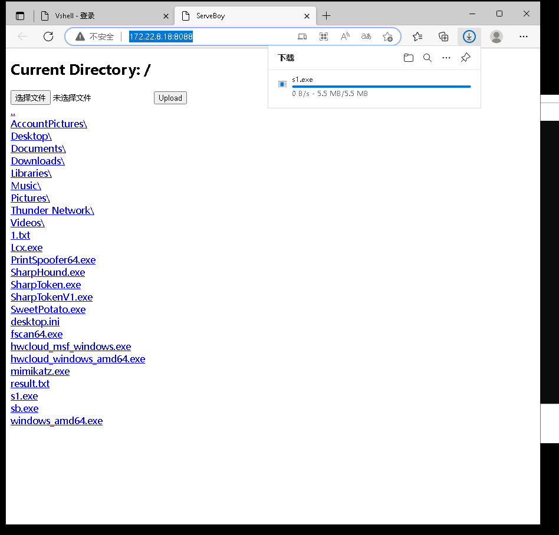

# ServeBoy
ServeBoy（简称SB）是一个用go语言编写的搭建简单的http文件服务命令行工具，支持目录展示，文件上传。目前支持windows/linux平台。

其实这个小玩意主要用于本菜鸡打渗透的时候使用（我知道渗透测试中还有一万种更优雅的文件传输方案别骂了别骂了555）
## 使用
```
Usage of ./sb:
  -d string
        directory to serve (default ".")
  -p string
        port (default "8088")
  -u    enable upload

```
注：文件上传功能默认关闭，防止被反打把我猜（

example:

`./sb -u`
## 截图

## TODOs
- [x] Folder display
- [x] Download files
- [x] Upload files (requires adding command-line arguments when starting)

